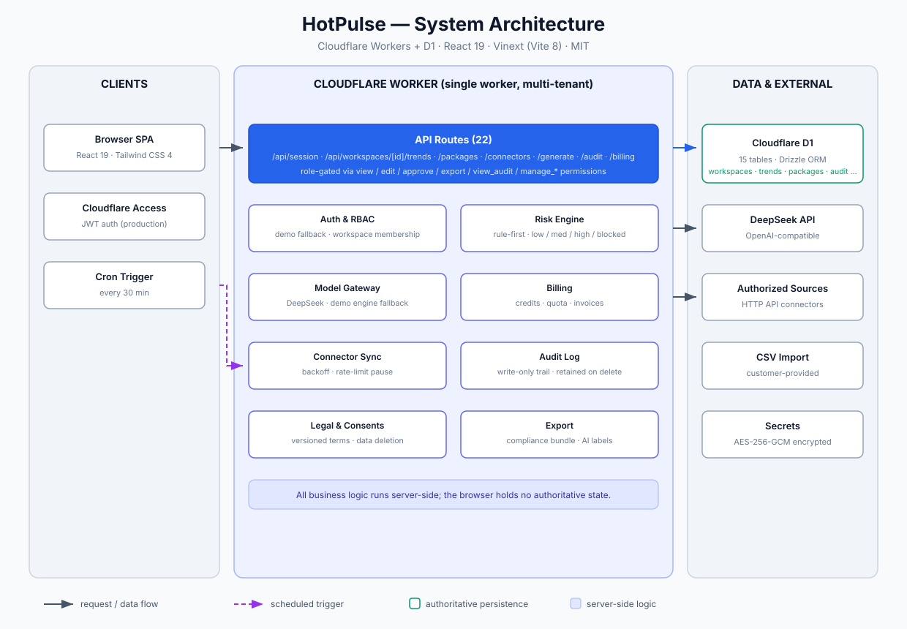
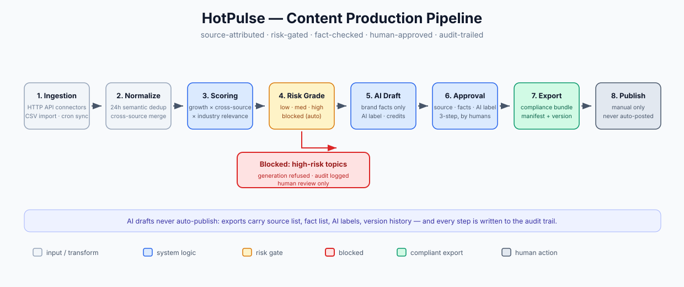

# HotPulse — Hot Trend Content Operations Platform

[简体中文](./README.md) | **English** | [日本語](./README.ja.md)

HotPulse is a hot-trend content operations platform for local brands: it turns “spot a trend → decide whether it’s worth following → draft content → human review → compliant export” into a single workflow, putting source attribution, brand facts, AI labels, and approval records ahead of conversion rate.

It is **not** an auto-posting tool: every content draft is AI-generated, clearly labeled, and must pass human approval before it can be published. See [AGENTS.md](./AGENTS.md) for the behavioral charter and [requirements.md](./requirements.md) for full requirements and acceptance criteria.

Current status: `0.1.0` runnable MVP with server-side persistence and multi-tenant authorization ready.

## Features

| Module | Capability |
|---|---|
| Trend Radar | Authorized HTTP API connectors (credentials encrypted with AES-256-GCM, exponential backoff, rate-limit pause) plus customer CSV import (labeled “customer-provided”), 24-hour semantic deduplication, cross-source merging with all original links preserved |
| Trend Analysis | Heat score, growth rate, cross-source appearance count; transparent ranking dimensions with refresh timestamps |
| Brand Profile | Brand facts that must be referenced during generation — no placeholder output when facts are missing |
| Content Studio | DeepSeek/OpenAI-compatible gateway generates content packages (falls back to a clearly-labeled demo engine when no API key is configured); editable with version history and restore |
| Risk Grading | News/medical/financial/legal/minors/disaster/political topics auto-escalate risk; high-risk topics block marketing generation entirely |
| Human Approval | Three-step approval (source / facts / AI label); content locks after approval; compliant export bundle |
| Audit Trail | Every generate/edit/approve/export/connector-failure is traceable; audit records are legally retained even after account data deletion |
| Billing Pilot | 30 free trial credits; admin-activated Pro plan (¥399/month/workspace, 150 credits/month); usage and invoice records |
| User Terms | Terms & privacy consent tracking, support/data-request tickets, account data deletion |

> All trends, brands, and data sources shown in the UI are **mock data** for demo purposes only. Do not publish them as real hot trends or business facts.

## Project Map

```
app/                    Frontend pages and API routes (Next.js-style app dir)
├── HotPulseApp.tsx     Single-page app shell (workspace UI)
└── api/                22 server routes (/api/trends, /api/packages, /api/connectors ...)
lib/                    Core libs: auth, risk, billing, audit, connector sync, model gateway, crypto
db/schema.ts            Database schema (15 tables, Drizzle ORM)
drizzle/                SQL migrations (0000/0001/0002 — do not edit by hand)
worker/index.ts         Worker entry + Cron sync (every 30 minutes)
tests/                  10 integration tests (node --test with in-process D1)
scripts/vinext.mjs      Dev/build scripts (Vinext framework)
wrangler.jsonc          Production deploy config (Worker + D1 + Cron + vars)
vite.config.ts          Local dev config (Vite 8 + Cloudflare plugin)
```

## Architecture





Key points:

- **Single worker, multi-tenant**: all business logic (auth / risk / generation / billing / audit) runs server-side; the browser holds no authoritative state;
- **D1 is the source of truth**: 15 tables managed by Drizzle ORM; migrations live in `drizzle/`;
- **Cron sync**: connector sync runs every 30 minutes with exponential backoff and rate-limit pause;
- **Encrypted credentials**: connector keys/tokens are encrypted with AES-256-GCM; keys are injected via `wrangler secret`;
- **Compliance loop**: generate → approve → export is fully audited; exports carry source list, fact list, AI labels, and version history.

## Local Development (5 minutes)

Prerequisites: Node.js `>=22.13.0` (PowerShell on Windows, bash on macOS/Linux).

```bash
npm install
npm run dev
```

Open http://localhost:3000. The default setup uses a demo user + demo engine — **no API keys or accounts required**:

- Accept the user terms & privacy policy on first visit (minimal built-in texts)
- Create a brand workspace → add connectors (HTTP API / CSV import) → generate drafts → approve → export
- For real AI generation: copy `.dev.vars.example` to `.dev.vars`, fill in `DEEPSEEK_API_KEY`, and restart `npm run dev`

Other commands:

```bash
npm test                  # 10 integration tests (multi-tenancy/crypto/audit/billing/legal flows)
npm run build             # Production build (outputs dist/ for deployment)
npm run lint              # ESLint
npm run db:generate       # Generate a migration after schema changes
npm run db:migrate:local  # Apply migrations to the local D1
```

## Deploy to Cloudflare (Production)

### 1. Prerequisites

- A [Cloudflare account](https://dash.cloudflare.com) (the free Worker tier is enough to start)
- Wrangler logged in: `npx wrangler login`
- Node.js `>=22.13.0`

### 2. Create the D1 database

```bash
npx wrangler d1 create hotpulse-d1
```

Replace `database_id` in `wrangler.jsonc` (`d1_databases[0].database_id`) with the output.

### 3. Configure secrets (never commit these)

```bash
npx wrangler secret put CONNECTOR_SECRET_KEY   # credential encryption key, 32-byte hex: openssl rand -hex 32
npx wrangler secret put DEEPSEEK_API_KEY       # model API key (optional; demo engine otherwise)
npx wrangler secret put ADMIN_API_KEY          # admin/manual-billing endpoint key (optional)
```

### 4. Edit the placeholder vars in wrangler.jsonc

| Variable | Description |
|---|---|
| `CF_ACCESS_JWT_VERIFY` | `"true"` enables Cloudflare Access authentication (recommended for production); leave `"false"` for demo-only access (anyone can open it) |
| `CF_ACCESS_AUD` / `CF_ACCESS_CERTS_URL` | Access app Audience Tag and certificate URL |
| `ADMIN_USER_IDS` | Global admin user IDs who can manually activate billing |
| `SUPPORT_EMAIL` | Contact email shown on the support/tickets page |

### 5. Build, migrate, deploy

```bash
npm run build
npm run db:migrate:remote   # apply all migrations (0000/0001/0002) to remote D1
npx wrangler deploy
```

After deploy: open the Worker domain → accept the terms → create a workspace → use it. The Cron trigger (connector sync every 30 minutes) is active automatically.

### 6. Production checklist

- [ ] Connect at least one authorized data source (official platform API or written-authorized supplier; scraping/cookie bypass is prohibited)
- [ ] `CONNECTOR_SECRET_KEY` set and backed up safely (stored credentials cannot be decrypted if lost)
- [ ] If Access auth is enabled, verify non-members are rejected (multi-tenant isolation)
- [ ] `LEGAL_VERSION` matches the terms/privacy texts
- [ ] Test account data deletion and support tickets; confirm audit records are retained

## Configuration Reference

| Key | Location | Description |
|---|---|---|
| `CF_ACCESS_JWT_VERIFY` | vars | Auth switch; local dev defaults to `false` (overridden in vite.config.ts), production defaults to `true` |
| `AUTH_DEMO_USER` | `.dev.vars` | Local demo user `userId\|email\|name`; built-in default when unset |
| `GENERATION_ENGINE` | vars | `model` = real model / `demo` = demo engine |
| `DEEPSEEK_BASE_URL` / `DEEPSEEK_MODEL` | secret/vars | Model gateway URL and model name (OpenAI-compatible) |
| `LEGAL_VERSION` | vars | User terms version |
| `ADMIN_API_KEY` | secret | Manual admin/billing endpoint key |

## Tech Stack

- TypeScript, React 19, Vinext (Vite 8, Next.js-style app dir), Tailwind CSS 4
- Cloudflare Workers (API routes + Cron sync) + D1 + Drizzle ORM (15 tables)
- DeepSeek/OpenAI-compatible model gateway, AES-256-GCM credential encryption
- 10 integration tests (node --test + in-process D1); build/test/lint all green

This stack keeps a single codebase covering responsive web, server APIs, database, and hosting — minimizing deployment and maintenance cost during the pilot phase.

## Business Assumptions (for founders)

Start with a single vertical pilot rather than selling a generic “AI copywriting tool”. A starting price of `¥399/month/workspace` (industry trend analysis, fixed content credits, compliant export) is a testable hypothesis, not a revenue guarantee; renewals should be proven by sustained usage, approved-and-exported volume, and time saved. Billing is currently activated manually by an admin; a real payment gateway is out of scope for v1.

## License

[MIT](./LICENSE)
